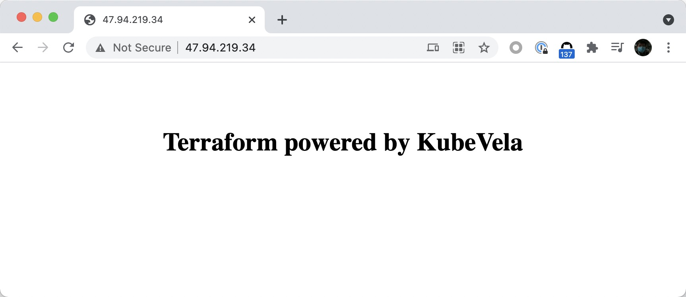

# nginx-web-on-ecs
A Terraform module to create an ECS, install Nginx and deploy a website in it.

## Getting started

```terraform
module "website" {
  source = "github.com/zzxwill/nginx-web-on-ecs"

  zone_id = var.zone_id
  password = "PasefjsfdY123!"
}

variable "zone_id" {
  description = "Zone ID"
  type = string
  default = "cn-beijing-i"
}

variable "password" {
  description = "ECS instance password for root user"
  type = string
  default = "PasefjsfdY123!"
}

output "URL" {
  value = module.website.console_url
}
```

```shell
$ terraform apply -auto-approve
alicloud_eip.server[0]: Creating...
module.vpc.alicloud_vpc.vpc: Creating...
alicloud_eip.server[0]: Creation complete after 2s [id=eip-2zeshn9q8f16dxqxg1czn]
data.template_file.server: Reading...
data.template_file.server: Read complete after 0s [id=aa7909773c377462e744c1cc5824b1e8d694154ef1b06161dd16d1b579b7de71]
module.vpc.alicloud_vpc.vpc: Creation complete after 6s [id=vpc-2zex3i721hqq5pt1h6kte]

...

null_resource.deploy (remote-exec):   nginx-mod-stream-1:1.14.1-9.module_el8.0.0+184+e34fea82.x86_64

null_resource.deploy (remote-exec): Complete!
null_resource.deploy (remote-exec): Redirecting to /bin/systemctl start nginx.service
null_resource.deploy: Provisioning with 'file'...
null_resource.deploy: Creation complete after 31s [id=5115345423942850689]
alicloud_eip_association.server: Creation complete after 36s [id=eip-2zeshn9q8f16dxqxg1czn:i-2zej6hlo0dlyjkuky57t]

Apply complete! Resources: 10 added, 0 changed, 0 destroyed.

Outputs:

console_url = "http://47.94.219.34/"
```




